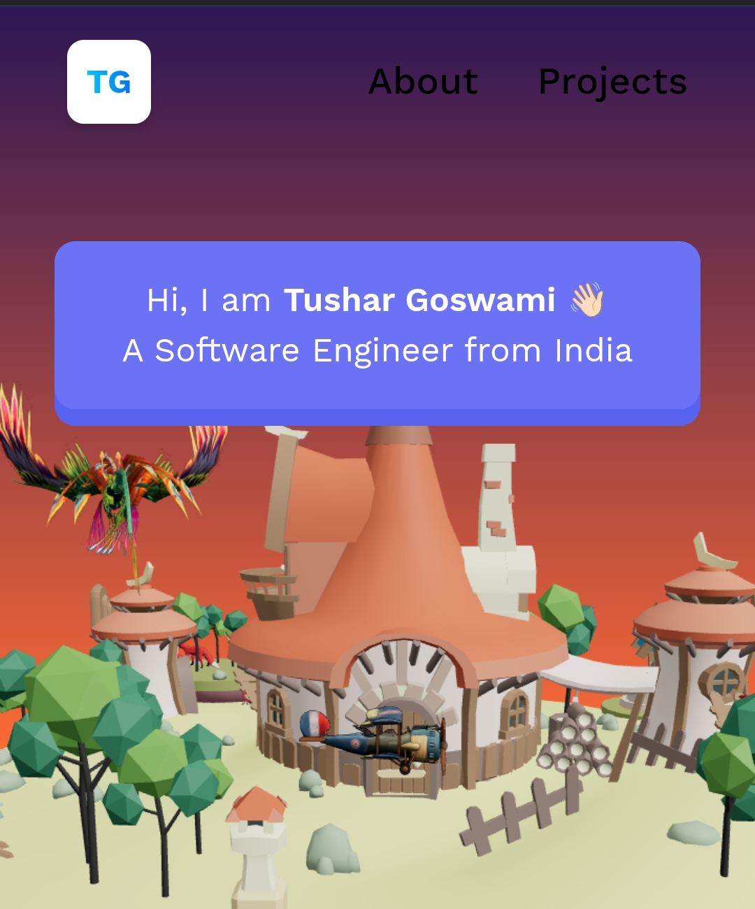

# 🌐 3D Portfolio

A modern and interactive **3D portfolio website** built with **React, Vite, Three.js, and React Three Fiber**. This portfolio showcases my projects, technical skills, and experience through smooth 3D animations and a responsive user interface.

## 🚀 Live Demo

🔗 https://tushargos.vercel.app

## ✨ Features

- 🎨 Interactive 3D experience
- 📱 Fully responsive design
- ⚡ Fast performance with Vite
- 💼 Project showcase
- 👨‍💻 About Me section
- 🖥️ Modern UI/UX
- 🌐 Smooth navigation

## 🛠️ Tech Stack

- React.js
- Vite
- Three.js
- React Three Fiber
- Tailwind CSS
- JavaScript
- HTML5
- CSS3

## 📂 Project Structure

```
3d_Portfolio/
├── public/
├── src/
├── assets/
├── components/
├── constants/
├── App.jsx
├── main.jsx
└── package.json
```

## ⚙️ Installation

Clone the repository:

```bash
git clone https://github.com/Tushargos77/3d_Portfolio.git
```

Go to the project folder:

```bash
cd 3d_Portfolio
```

Install dependencies:

```bash
npm install
```

Run the development server:

```bash
npm run dev
```

Build for production:

```bash
npm run build
```

## 📸 Preview


Example:

```

```

## 📬 Contact

**Tushar Goswami**

- 🌐 Portfolio: https://tushargos.vercel.app
- 💻 GitHub: https://github.com/Tushargos77
- 💼 LinkedIn: https://www.linkedin.com/in/tushar-goswami-164334278

## ⭐ Support

If you like this project, please consider giving it a ⭐ on GitHub.

## 📄 License

This project is licensed under the MIT License.
